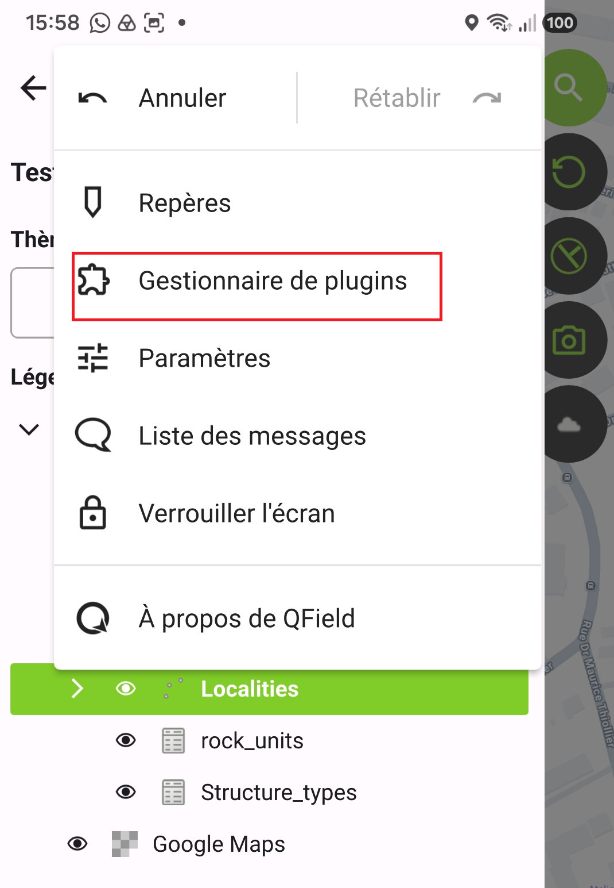
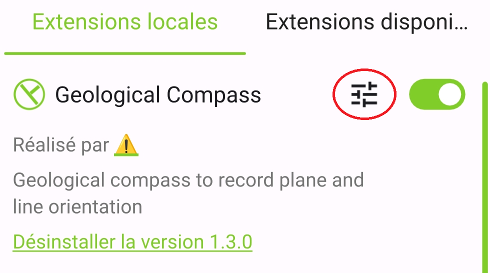
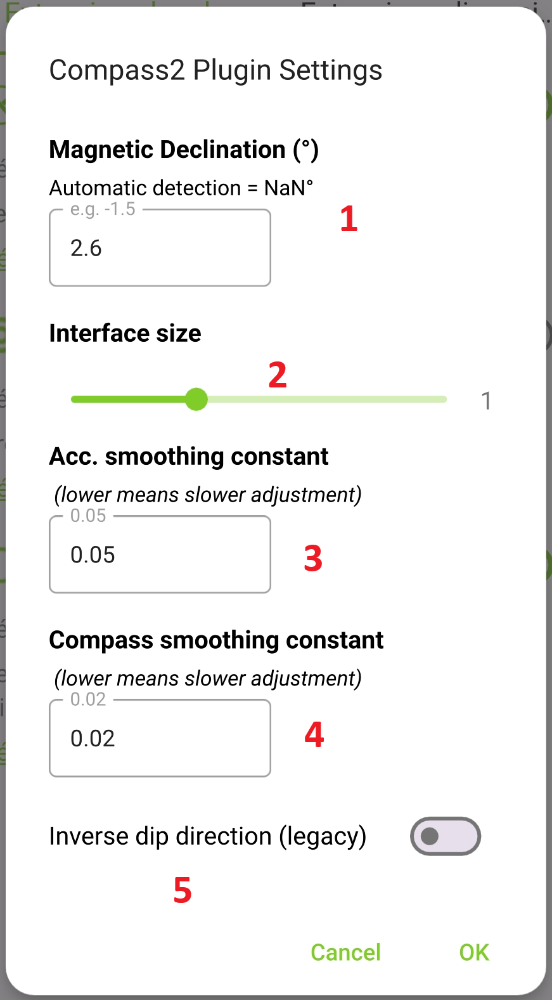
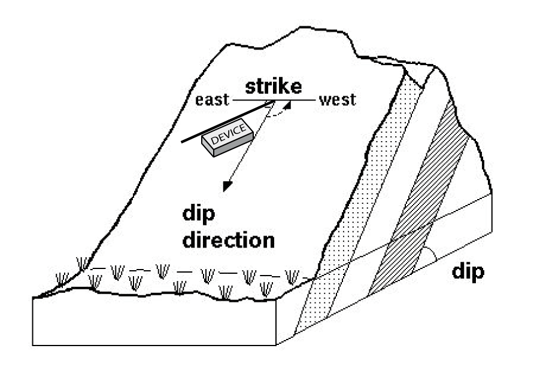
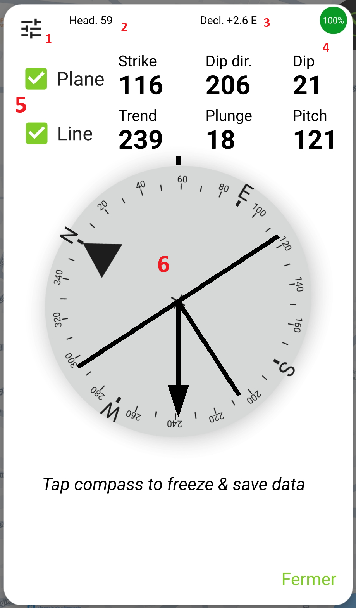
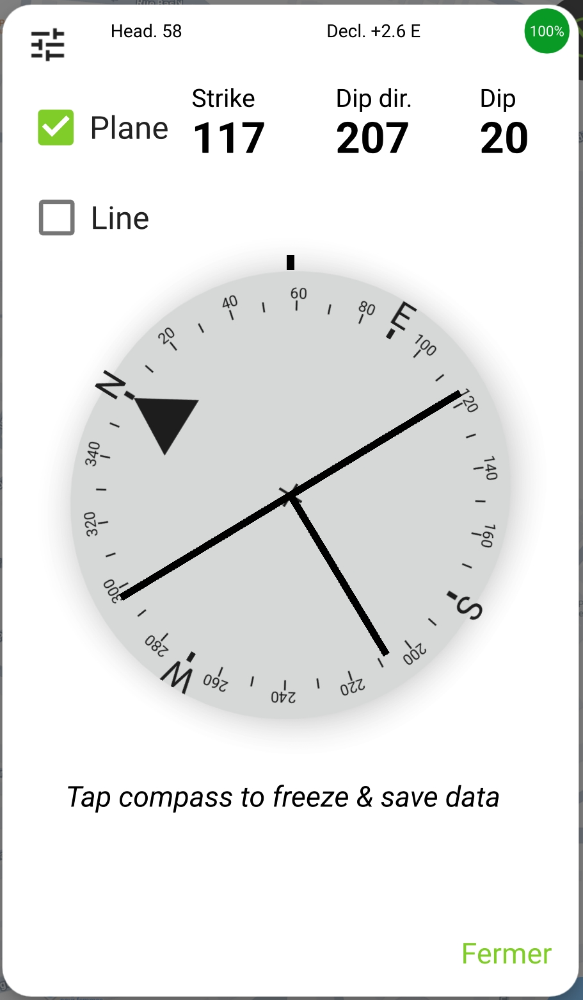
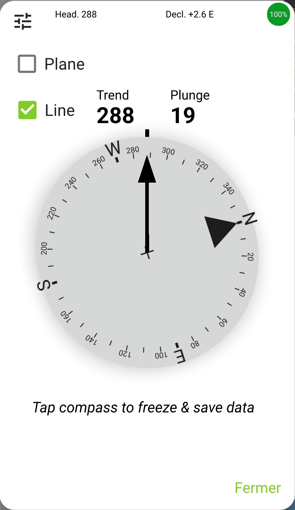
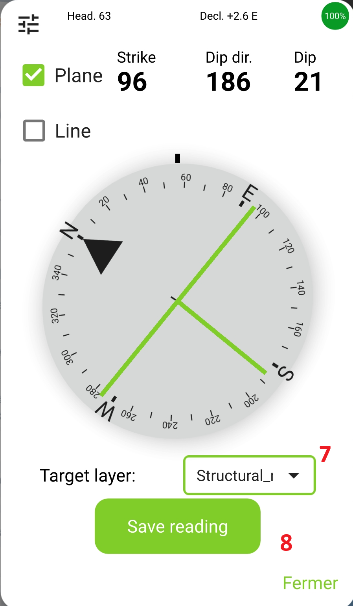

# QField_qml_Geological_compass
A QField plugin adding a geological compass app to record plane and line orientation

QField is a portable version of QGIS. I am using it for geological mapping, using a suite of tools to tweak the functionalities to the specific needs of this activity:
- A QGIs project and database template ([here!](https://github.com/jfmoyen/QField_Geological_mapping_template/));
- A plugin adding a geological compass to measure and record planes and lines ([you are here!](https://github.com/jfmoyen/QField_qml_Geological_compass)), adapted from [Mark Jessel's work](https://github.com/swaxi/compass);
- A plugin streamlining the use of camera ([here](https://github.com/jfmoyen/QField_MySnap)), modified from [QField plugin Snap!](https://github.com/opengisch/qfield-snap)

  The three tools can be used independently. Together, they offer a platform that works well (at least, for me) in the field. A source of inspiration for this project is the [FieldMove]((https://www.petex.com/products/move-suite/digital-field-mapping/)) application: the first goal was to reproduce FieldMove's functionalities, but adding the flexibility and "openness" of QField.

## The compass plugin

This QField application-wide [plugin](https://docs.qfield.org/how-to/advanced-how-tos/plugins/) reads the orientation sensors from your device and converts into orientations of planes and/or lines, recorded using geological conventions (see you Structural Geology 101 course if required :-) ). You can read orientations on the fly or "freeze" the data and save it to a point layer.

## Installation
Like all [QField plugins](https://docs.qfield.org/how-to/advanced-how-tos/plugins/#application-plugins), you can do any of the following:
1. Download manually the plugin files and copy them to the `Android/data/ch.opengis.qfield/files/QField/plugins/Geological_Compass` of your (Android) device (iOS users, locate the plugin directory and copy the files there!)
2. Install from url using the following url: [github.com/jfmoyen/QField_qml_Geological_compass/blob/main/QField_qml_Geological_compass.zip](https://github.com/jfmoyen/QField_qml_Geological_compass/blob/main/QField_qml_Geological_compass.zip)
3. Install by scanninng this QRCode (this is a shortcut to the same url):


In any case, do not forget to activate the plugin (go to the side dashboard -> 3 dots menu -> plugins -> local plugins -> activate using the switch)



## Setup and options
> [!IMPORTANT]
In most cases, magnetic declination is the only thing you should worry about.

Settings are accessed from the plugin settings menu:
1. Open the Side Dashboard and tap the three dots icon to open Settings.
2. Tap Plugins
3. Next to the plugin name, tap on the settings button



You can then change the following parameters (they will remain so until you change them again - they are *not* automatically restored when you open the application, load a project or even reload the plugin):


1. The **magnetic declination** (i.e. the difference between true North and magentic North). Positive is East (MN is to the East of TN), negative is West. Depending on where you live, this may be as little as less than a degree, as much as more than 20 ! See for instance [this](https://www.ngdc.noaa.gov/geomag/calculators/magcalc.shtml). Notionally, your device may know about the declination (calculated from your position). However Qt (the toolbox used to build the interface) does not implement it in Android (see [this issue](https://github.com/opengisch/QField/issues/8006)). If this changes, or if you are in iOS (?), the automatically detected declination will be indicated. For now you have to type it manually.
2. The size of the main compass window (described below). 1, or 100% is the default. Use the slider to make it smaller/bigger.
3. Smoothing values for accelerometer. The readings from your device fluctuate a lot, because the sensors are not terribly precise. This makes the compass window hard to read as it moves all the time. The code dampens these fluctuations (specifically, a smoothing value of 0.05 means that each "new" reading changes the existing value by 5%; a reading is taken every 10 ms). This also implies that the plugin will react slowly to sudden changes in orientation. A larger value will cause the device to adjust more quickly, but at the cost of more unstable readings.
4. Idem, for the compass.
5. Inverse dip direction. In Mark's code, the value of dip direction is modified by 180° through a switch called "Southern Hemisphere". I am unsure whether this is actually needed (and won't be able to check before I do Southern field work), so the switch stays there for time being. If your readings appear reversed, turn it on.

## Capturing data


> [!TIP]
Once the plugin is succesfully installed and activated, tap the strike/dip icon to access the compass window.

The compass will record the following information:
1. The **plane** on which the device lies 
2. The **line** corresponding to the long axis of the device (specifically, the "vertical" edge of the device when you hold it in default, unrotated position).


Planar data will be reported with both *strike* and *dip direction* (right-hand rule), as well as *dip* angle.
Line attitude will be given as *trend* and *plunge* and, if a plane is also being recorded, as a *pitch*.

The main interface will show the following window:


> [!TIP]
The top bar (1-4) gives general status information. The current reading is given numerically (5) and graphically (6). Tap on the compass (6) to freeze the reading and save the data.

1. Shortcut to the setting menu
2. Current heading of the device: in which direction is the top of the screen? If your device is rotated, this is not necessarily the same as the long axis.
3. Declination (the one you have set manually - there is no automatic detection) (yet?)
4. Compass calibration indicator, given in %. It changes color for lower values.
5. Orientation reading for the plane (on which the phone rests) and the line (device long axis, irrespective of the current screen orientation)
6. Graphical representation of the same. The T symbol shows the plane attitude, whereas the arrow indicates the line. The wind rose rotates to show the proper direction of the North.

If you untick one of the boxes (5) for plane or line, the respective information disappears:


## Saving data

> [!TIP]
Tap the compass to access save options

If you tap the wind rose, the compass freezes (tap again to unfreeze). This allows to move your device and review the measurement, but importantly it also activates the save options.


7. Select the layer where you want to save the reading (the first option is always the "active layer", selected in QField's layer tree on the left). 
8. Save (and open the feature attribute form)

### What is saved?
The plugin tries to be clever and to recognize various names for the values of interest. If a field with one of the possible names (case sensitive !) is found, it will be populated. In any case you always get to see the attribute form, so you can review the values before saving.


|Field | Possible values |
| --- | --- |
| (Plane) strike | `strike_rhr` `strike`  `strike_ref` `P_strike` `Strike` |
| (Plane) dip direction | `dip_direction` `dipdirection` `dip_dir` `dipdir_ref` `P_dipAzimuth` `Dip direction`|
| (Plane) dip  | `dip` `dip_angle` `pendage` `dip_ref` `P_dip` `Dip` |
|   |  |
| (Line) trend | `L_plungeAzimuth`  `Trend`|
| (Line) plunge|  `plunge` `plongement` `L_plunge` `Plunge` |
| (Line) pitch | `pitch` `Pitch`  `L_pitch` |

It is quite easy to add more options by editing the code (case sensitive !) of file main.qml, near the top:
```
  property var dipFieldNames:          ["dip", "dip_angle", "pendage", "dip_ref", "P_dip", "Dip"]
  property var dipDirectionFieldNames: ["dip_direction", "dipdirection", "dip_dir", "dipdir_ref", "P_dipAzimuth", "Dip direction"]
  property var strikeFieldNames:       ["strike_rhr", "strike", "strike_ref", "P_strike", "Strike"]

  property var trendFieldNames:        ["L_plungeAzimuth", "Trend"]
  property var plungeFieldNames:       ["plunge", "plongement", "L_plunge", "Plunge"]
  property var pitchFieldNames:        ["pitch","Pitch","L_pitch"]
```

## How-to ?

Read the [companion document](under_the_hood.md) if you are interested in the technicities - or explore the [code](main.qml) ! 